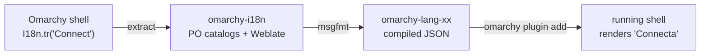

# omal10n-poc

Making the [Omarchy](https://omarchy.org) 4 desktop shell translatable — design work, prior-art
notes, and (eventually) a proof-of-concept language pack.

> **Status: design stage.** Nothing here is implemented yet. This repo currently holds the
> architecture proposal that needs to go in front of the Omarchy maintainers.

## The problem

Omarchy 4 rewrote the entire desktop shell in [Quickshell](https://quickshell.org). It is a
genuinely nice shell — and it is hardcoded English, end to end:

| | |
|---|---|
| QML in `shell/` | 175 files, ~37k lines |
| Calls to `qsTr` / `qsTranslate` / `QT_TR_NOOP` | **0** |
| Distinct user-facing English string literals | ~343 |
| Interactive `bin/` scripts with prompts and `--help` | ~35 |

So localizing Omarchy is not a config switch, and not something a user can opt into from their own
config. Every string site in the shell has to change, which makes it a question of upstream design
rather than local patching.

### Why `.ts` / `.qm` is not available

Quickshell constructs a bare `QQmlEngine` (`src/core/generation.cpp`), not a
`QQmlApplicationEngine`, and contains no reference to `QTranslator`, `installTranslator`,
`uiLanguage`, or `retranslate()`. There is no way to install a translator, and no automatic
`i18n/qml_<locale>.qm` loading.

`qsTr()` compiles and runs in Quickshell — and silently returns the source string forever.

## What the maintainers have asked for

Locale bugs have been filed and closed. On [#6360](https://github.com/basecamp/omarchy/issues/6360)
— the clock widget showing English weekday names under `es_MX.UTF-8` — DHH
[closed it with](https://github.com/basecamp/omarchy/issues/6360#issuecomment-5085300544):

> Need a comprehensive solution to full OS translation before this makes sense to me.

That is the bar, and it is a reasonable one: piecemeal locale patches accumulate into a
half-translated shell that is worse than an honestly English one. It also means the useful
contribution here is not another one-off fix — it's the comprehensive design he asked for.

That design is what this repo is.

## The proposal

Four components, two ownership boundaries. Only the primitive lands upstream.

| Component | Owner | Role |
|---|---|---|
| `qs.Commons.I18n` | **Upstream** | The primitive: locale selection, catalog registry, `tr()` / `ntr()` |
| `omarchy_t` | **Upstream** | Same lookup for the interactive `bin/` scripts |
| `omarchy-i18n` | Community | PO source of truth, extraction/build CI, Weblate target |
| `omarchy-lang-<xx>` | Community | Compiled catalogs shipped as an ordinary `service` plugin |

Two decisions carry most of the design:

- **The primitive is core, not a plugin.** Core `shell/Ui/` components need it, `import qs.Commons`
  can't be satisfied by a plugin, and the registry scan is async — a plugin-provided translator
  would flash English on every login.
- **A language pack *is* a plugin.** That inherits install, update-with-diff-review,
  enable/disable, and the plugins UI from machinery Omarchy already ships.

Catalogs are authored as **gettext PO** and compiled to JSON at build time. JSON is forced at
runtime (it's all QML can parse); PO is chosen for plural rules, `msgctxt` disambiguation,
translator comments, and `msgmerge` fuzzy state — which is the only real answer to upstream drift.

**→ Full write-up: [`omarchy-l10n-architecture.md`](./omarchy-l10n-architecture.md)**

## Contents

| File | |
|---|---|
| `omarchy-l10n-architecture.md` | The architecture proposal, for maintainers |
| `omarchy-l10n-architecture.html` | Same document, standalone browser version |

## Prior art

- [basecamp/omarchy#7434](https://github.com/basecamp/omarchy/pull/7434) — "Add shell translation
  catalogs" by @massisalva. A complete, working implementation: `I18n` singleton, `%1`
  interpolation, a Bash helper, tests, and a Spanish catalog. **Open, unreviewed by maintainers,
  currently conflicting.** At 86 files and +2154/−453 it is too large a unit to review against a
  branch moving this fast — the plan here is to reuse its design and land the ~250-line mechanism
  on its own first.
- [basecamp/omarchy#6360](https://github.com/basecamp/omarchy/issues/6360) — clock widget
  ignores system locale for weekday and month names. Closed pending a comprehensive translation
  design; the source of the quote above.
- [basecamp/omarchy#1187](https://github.com/basecamp/omarchy/issues/1187) — installer locale
  selection. Related but narrower: system locale, not shell strings.
- [Omarchy shell plugin docs](https://github.com/basecamp/omarchy/blob/quattro/manual/32-shell-plugins.md)
  — `manifest.json`, plugin kinds, and the IPC surface this design builds on.

## Next steps

1. Cut the mechanism-only branch from #7434 and verify the real line count
2. Add CLDR plural rules and domain-namespaced catalogs to the primitive
3. Take the proposal to the maintainers
4. Build `omarchy-lang-ca` as an end-to-end proof

## License

Design documents in this repo are MIT, matching Omarchy.
