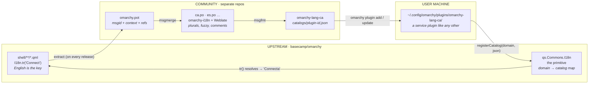
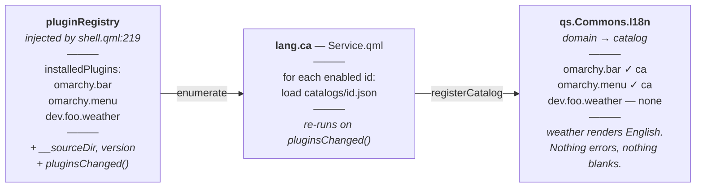

# Omarchy Localization Architecture

A four-part system for translating the Omarchy shell. Only one part — roughly **250 additive
lines** — needs to live in `basecamp/omarchy`. Catalogs, translator tooling, and language packs
all sit outside the repo and cost maintainers nothing to carry.

| | |
|---|---|
| **Status** | Draft for discussion |
| **Base** | `quattro` @ v4.0.1 |
| **Builds on** | [PR #7434](https://github.com/basecamp/omarchy/pull/7434) |

---

## The ask, up front

### One mechanism, no content, no behavior change

The upstream change is a translation primitive: a QML singleton exported from `qs.Commons`, its
pure-JS model, and a Bash counterpart for the CLI scripts. It ships with *zero* catalogs and
*zero* call-site conversions.

With no catalog present, `I18n.tr("Connect")` returns `"Connect"`. The change is a provable no-op
on a stock install, which makes it reviewable in one sitting and safe to revert.

| ~250 | 6 | 0 | 0 |
|:--|:--|:--|:--|
| lines upstream | files touched | runtime deps added | call sites changed |

Everything downstream of that primitive — extraction tooling, PO catalogs, a Weblate instance,
per-language packs — is community-maintained in separate repositories. Maintainers never review a
translation, and a stale or hostile catalog cannot break a shell that falls back to English by
construction.

---

## How the pieces fit

Source strings leave the repo once, come back as compiled catalogs, and the loop closes at the
same call sites they started from.

The loop closes inside the upstream band: the same `I18n.tr()` call that produced the extracted
string is the one that renders the translation. Everything between the two arrows in that band
happens in repositories Omarchy maintainers do not own.

---

## Components at a glance

| Component | Lives in | Owner | Role |
|---|---|---|---|
| **`qs.Commons.I18n`** the primitive — *not* a plugin | `shell/Commons/` `I18n.qml`, `I18nModel.js` | **Upstream** | Locale selection, catalog registry, plural rules, `tr()` / `ntr()` |
| **`omarchy_t`** Bash counterpart | `default/bash/i18n` sourced by `bin/` scripts | **Upstream** | Same lookup for the ~35 interactive CLI scripts |
| **`omarchy-i18n`** localization hub | own repo Weblate attaches here | Community | POT + PO source of truth, extraction and build CI, coverage dashboard |
| **`omarchy-lang-<xx>`** plugin id `lang.<xx>` | generated repo one per locale | Community | Ships compiled JSON catalogs as an ordinary `service` plugin |

---

## The components in detail

### `qs.Commons.I18n` — Upstream

The runtime primitive, largely as written in PR #7434: a `pragma Singleton` exported from the
`qs.Commons` module, backed by a dependency-free `I18nModel.js` that is unit-testable outside QML.

- **Exposes** — `tr(source, args)`, `ntr(count, singular, plural, args)`, `registerCatalog(domain, json)`
- **Selects** — `LANGUAGE` → `LC_ALL` → `LC_MESSAGES` → `LANG`, with regional fallback (`ca_ES` → `ca`)
- **Fallback** — missing domain, missing key, or malformed catalog all yield the English source string
- **Changes vs #7434** — multi-source catalogs keyed by domain rather than one global file; CLDR plural rules rather than a hardcoded two-form test

### `omarchy_t` — Upstream

Roughly 30 lines of Bash sourced by the interactive `bin/` scripts, reading the same compiled
JSON. It exists because a meaningful share of Omarchy's user-facing text is `gum` prompts and
`--help` output, not QML.

- **Constraint** — must be `set -u` safe; several callers enable nounset before sourcing
- **Never touches** — command routes, flag names, or machine-readable JSON output

### `omarchy-i18n` — Community

The authoring hub, in the shape of GNOME's Damned Lies or `translate.wordpress.org`: translators
and tooling meet here, and nothing here ever ships to a user machine directly.

- **Holds** — `core/<locale>.po` and `plugins/<plugin-id>/<locale>.po`
- **Tooling** — `omarchy-i18n-extract` (QML → POT), `omarchy-i18n-build` (PO → namespaced JSON)
- **Why PO** — plural rules, `msgctxt` disambiguation, developer comments, and — critically — `msgmerge` fuzzy state for tracking upstream drift
- **Later** — Weblate attaches to this repo with no change to the layout

### `omarchy-lang-<xx>` — Community

A language pack is an ordinary Omarchy plugin. That single decision buys install, update with diff
review, enable/disable, and a listing in the plugins UI — all from machinery that already exists.

- **Manifest** — `{ "id": "lang.ca", "kinds": ["service"], "keepLoaded": true }`
- **Contains** — `Service.qml` (~60 lines) plus `catalogs/<plugin-id>.json`
- **Distribution** — `omarchy plugin add <url>`; refreshed by the existing `omarchy plugin update`, which already fetches, shows a diff, and confirms
- **If blessed** — could later ship first-party as `omarchy.lang.ca` with no design change

---

## Why the primitive is core and the language pack is a plugin

The translator itself cannot be a plugin, for three concrete reasons:

1. **Core UI needs it.** `shell/Ui/ConfirmDialog.qml`, `MultiSelect.qml`, and
   `SearchableDropdown.qml` all contain user-facing strings and are not plugins.
2. **Import-time resolution.** Plugins reach shared code through `import qs.Commons`. A singleton
   in that namespace is available to every plugin with zero wiring; a plugin cannot provide one.
3. **Load order.** The registry scan is a `Process`, so it completes asynchronously after the bar
   has already rendered. A plugin-provided translator would produce a visible flash of English on
   every login.

Catalogs have the opposite profile: large, frequently updated, locale-specific, and of no interest
to a user who doesn't speak the language. Those are exactly the properties the plugin system exists
to manage.

The language pack discovers what to translate rather than being told. Because catalogs are
namespaced by plugin id, a third-party plugin gets its own translation domain — and an
untranslated plugin degrades to English instead of failing.

---

## Sequence

Ordered by dependency: each step is independently useful, and steps 3–4 need no further maintainer
review.

**1. Land the primitive** · *Upstream*
Mechanism only: `I18n.qml`, `I18nModel.js`, `qmldir`, `default/bash/i18n`, docs, tests. No call
sites, no catalogs. Reviewable as a no-op.

**2. Convert call sites, plugin by plugin** · *Upstream*
One small PR per plugin, each independently revertible: `bar`, `menu`, `notifications`, `lock`,
then the `panels` tree. PR #7434 has already done this work — it only needs splitting.

**3. Stand up the hub** · *Community*
Extraction CI, the POT, and the first PO catalogs. Publishes a coverage report per plugin version
so drift is visible rather than discovered.

**4. Publish the first language pack** · *Community*
`omarchy-lang-ca` as proof of the whole chain, installable with `omarchy plugin add`. Weblate can
attach at any point after this without changing the architecture.

---

## Open questions

**Should security-surface strings be translatable at all?**
The polkit agent and lock screen render text that an attacker would love to reword. Catalogs are
data, not code, so nothing executes — but a hostile catalog could reword an authentication prompt.
Options: keep those domains first-party-only, or exclude them.

**Does a plugin declare its translation domain, or is the id enough?**
The plugin id already works as an implicit domain and needs no manifest change. An explicit
`"translations"` field would be more legible but adds schema surface for little gain.

**Who owns the language-pack namespace?**
The registry reserves `omarchy.*` for first-party plugins, so community packs need a different
prefix — `lang.ca` is the simplest. If packs ever ship with the distro, they would move to
`omarchy.lang.ca`.

**Is a gettext toolchain acceptable in CI?**
It adds nothing to the runtime — users still get plain JSON and no new packages. But `msgmerge` and
`msgfmt` would become contributor-side dependencies for anyone regenerating catalogs.

---

Measurements taken against `basecamp/omarchy@quattro` v4.0.1.
Shell source: 175 files, ~37k lines QML. 90-day churn in `shell/`: +18,959 / −11,404 across 316 commits.
Distinct English string literals in `shell/`: ~343.
