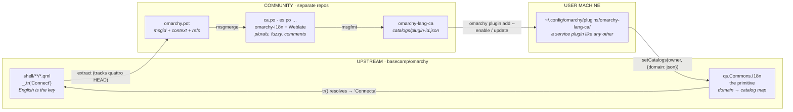
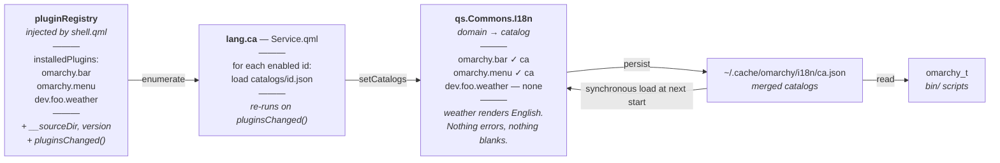

# Omarchy Localization Architecture

A four-part system for translating the Omarchy shell. Only one part — roughly **750 additive
lines**, half of them comments — needs to live in `basecamp/omarchy`. Catalogs, translator tooling, and language packs
all sit outside the repo and cost maintainers nothing to carry.

| | |
|---|---|
| **Status** | Draft for discussion |
| **Base** | `quattro` @ v4.0.1 |
| **Builds on** | [PR #7434](https://github.com/basecamp/omarchy/pull/7434) |

---

## The ask, up front

### One mechanism, no content, no behavior change

The upstream change is a translation primitive: a QML singleton exported from `qs.Commons`, its
pure-JS model, and a Bash counterpart for the CLI scripts. It ships with *zero* catalogs and
*zero* call-site conversions.

With no catalog present, `I18n.tr("Connect")` returns `"Connect"`. The change is a provable no-op
on a stock install, which makes it reviewable in one sitting and safe to revert.

| 744 | 4 + 1 | 0 | 0 |
|:--|:--|:--|:--|
| lines upstream (≈540 without comments) | files, plus one `qmldir` line | runtime deps added | call sites changed |

Everything downstream of that primitive — extraction tooling, PO catalogs, a Weblate instance,
per-language packs — is community-maintained in separate repositories. Maintainers never review a
translation, and a stale or malformed catalog cannot break a shell that falls back to English by
construction.

---

## How the pieces fit

Source strings leave the repo once, come back as compiled catalogs, and the loop closes at the
same call sites they started from.



The loop closes inside the upstream band: the same `tr()` call that produced the extracted string
is the one that renders the translation. Everything between the two arrows in that band happens
in repositories Omarchy maintainers do not own.

---

## Components at a glance

| Component | Lives in | Owner | Role |
|---|---|---|---|
| **`qs.Commons.I18n`**<br/>the primitive — *not* a plugin | `shell/Commons/`<br/>`I18n.qml`, `I18nModel.js` | **Upstream** | Locale selection, catalog registry, plural rules, `tr()` / `ntr()`, startup cache |
| **`omarchy_t`**<br/>Bash counterpart | `default/bash/i18n`<br/>sourced by `bin/` scripts | **Upstream** | Same lookup for the ~35 interactive CLI scripts, from the cache file |
| **`omarchy-i18n`**<br/>localization hub | own repo<br/>Weblate attaches here | Community | POT + PO source of truth, extraction and build CI, coverage dashboard |
| **`omarchy-lang-<xx>`**<br/>plugin id `lang.<xx>` | generated repo<br/>one per locale | Community | Ships compiled JSON catalogs as an ordinary `service` plugin |

---

## The components in detail

### `qs.Commons.I18n` — Upstream

The runtime primitive, building on PR #7434: a `pragma Singleton` exported from the `qs.Commons`
module, backed by a dependency-free `I18nModel.js` that is unit-testable outside QML.

- **Exposes** — `tr(source, args)`, `trc(context, source, args)`, `ntr(count, singular, plural, args)`, `noop(source)`, `domain(id)`, `setCatalogs(ownerId, catalogs)`, `revision`
- **Selects** — `LANGUAGE` → `LC_ALL` → `LC_MESSAGES` → `LANG`, with regional fallback (`ca_ES` → `ca`)
- **Resolves** — per key; bound callers walk `domain` → `clonedFrom` → global merge → English source, unbound callers skip straight to the global merge (see [Runtime contract](#runtime-contract))
- **Reserved domains** — `omarchy.shell` for `shell/Ui` and `shell/services`, `omarchy.cli` for `bin/`; neither has a plugin id
- **Reactive** — every lookup reads `revision`, so QML bindings re-evaluate when a catalog registers
- **Startup** — loads `~/.cache/omarchy/i18n/<locale>.json` synchronously before the first frame; language packs refresh that file after the registry scan
- **Fallback** — missing domain, missing key, or malformed catalog all yield the English source string
- **Changes vs #7434** — catalogs keyed by domain rather than one global file; scoped lookup via `domain(id)`; owned registration with an inverse; CLDR plural rules rather than a hardcoded two-form test; `noop()` for strings defined away from their use; the startup cache

### `omarchy_t` — Upstream

Roughly 30 lines of Bash sourced by the interactive `bin/` scripts. These run outside the shell
process — on a tty, over ssh, under `sudo` — so they cannot ask the singleton. They read the same
`~/.cache/omarchy/i18n/<locale>.json` the primitive maintains: one file, no plugin enumeration, no
knowledge of which language packs exist. `jq` is already a dependency of the plugin tooling.

- **Constraint** — must be `set -u` safe; several callers enable nounset before sourcing
- **Never touches** — command routes, flag names, or machine-readable JSON output
- **Plurals** — a small evaluator for the `plural-forms` header; the CLI needs a handful of plural strings

### `omarchy-i18n` — Community

The authoring hub, in the shape of GNOME's Damned Lies or `translate.wordpress.org`: translators
and tooling meet here, and nothing here ever ships to a user machine directly.

- **Holds** — `core/<locale>.po` (the `omarchy.shell` and `omarchy.cli` domains) and `plugins/<plugin-id>/<locale>.po`
- **Tooling** — `omarchy-i18n-extract` (QML → POT, domain derived from file path, verified against the file's declared binding), `omarchy-i18n-build` (PO → namespaced JSON)
- **Why PO** — plural rules, `msgctxt` disambiguation, developer comments, and — critically — `msgmerge` fuzzy state for tracking upstream drift
- **Collision check** — the build warns when two domains translate one `msgid` differently, since that is exactly the case an unbound caller would get wrong
- **Later** — Weblate attaches to this repo with no change to the layout

### `omarchy-lang-<xx>` — Community

A language pack is an ordinary Omarchy plugin. That single decision buys install, update with diff
review, enable/disable, and a listing in the plugins UI — all from machinery that already exists.

- **Manifest** — `{ "id": "lang.ca", "kinds": ["service"] }`
- **Contains** — `Service.qml` (~60 lines) plus `catalogs/<plugin-id>.json`
- **Behaviour** — checks that its locale is among the active candidates, then registers one catalog per installed and enabled plugin; re-runs on `pluginsChanged()`; registration is owned, so disabling the pack removes its catalogs
- **Distribution** — `omarchy plugin add <url> --enable` (third-party plugins install disabled by default); refreshed by the existing `omarchy plugin update`, which already fetches, shows a diff, and confirms
- **Trust** — catalogs are data, but the pack itself is a plugin with QML that runs unsandboxed; enabling one is trusting code, exactly as with any other plugin
- **If blessed** — could later ship first-party as `omarchy.lang.ca` with no design change

---

## Why the primitive is core and the language pack is a plugin

The translator itself cannot be a plugin, for two concrete reasons:

1. **Core UI needs it.** `shell/Ui/ConfirmDialog.qml`, `MultiSelect.qml`, and
   `SearchableDropdown.qml` all contain user-facing strings and are not plugins.
2. **Import-time resolution.** Plugins reach shared code through `import qs.Commons`. A singleton
   in that namespace is available to every plugin with zero wiring; a plugin cannot provide one.

Catalogs have the opposite profile: large, frequently updated, locale-specific, and of no interest
to a user who doesn't speak the language. Those are exactly the properties the plugin system exists
to manage.

There is a cost to that split, and the design has to pay it explicitly. The registry scan is a
`Process`; `shell.qml` renders the bar before it returns, and services — the language pack
included — load only afterwards. Left alone, every login would flash English for a few hundred
milliseconds before the catalogs arrive. Two mechanisms close that gap: lookups are reactive, so
bindings repaint the moment a catalog registers; and the primitive persists the merged catalogs to
`~/.cache/omarchy/i18n/<locale>.json` and loads that file synchronously at the next start. The first
login after installing a pack flashes once. No later one does.



The language pack discovers what to translate rather than being told. Because catalogs are
namespaced by plugin id, a third-party plugin gets its own translation domain — and an
untranslated plugin degrades to English instead of failing.

---

## Runtime contract

The three things every downstream piece depends on: how a call site names its domain, how a key
resolves, and what a catalog file looks like.

### Call sites

A singleton cannot know which plugin called it, so a file that wants its own domain says so — one
line at its root, the same convention GNOME Shell extensions use with
`Gettext.domain(uuid)`:

```qml
import qs.Commons

Item {
  readonly property var _: I18n.domain("dev.foo.weather")

  Text { text: _.tr("Connect") }
  Text { text: _.trc("verb", "Open") }              // msgctxt disambiguation
  Text { text: _.ntr(n, "%1 city", "%1 cities", [n]) }
}
```

Core files under `shell/Ui` and `shell/services` call `I18n.tr()` unbound and resolve in
`omarchy.shell`. A third-party plugin that never binds still works — it simply shares the global
namespace. Strings defined away from their use (a JS model returning `"Connection failed"` that is
translated later) are wrapped in `I18n.noop()` at their definition so the extractor sees them;
otherwise coverage silently lies, as several reviews of #7434 pointed out.

### Resolution

Lookup happens **per key**, first hit wins:

```
bound caller:    own domain  →  omarchy.clonedFrom (if any)  →  global merge  →  English source
unbound caller:                                                  global merge  →  English source
```

The *global merge* is every registered catalog folded into one map in precedence order: originals
first, clones after, so a clone's translation shadows the original's. `omarchy plugin clone`
rewrites a plugin's manifest `id` and stamps `omarchy.clonedFrom` with the original, which is what
lets a cloned plugin resolve against its own catalog first and fall through to upstream's for
everything it did not change — the same routing the shell already applies to a clone's IPC calls.

| Case | Resolves to |
|---|---|
| Clone adds a string and translates it | clone catalog |
| Clone inherits an upstream string unchanged | upstream catalog |
| Clone overrides one upstream translation | clone catalog shadows it |
| Two plugins translate one English word differently, both bound | each gets its own |
| Same, but a caller is unbound | whichever registered last — the collision the hub's build warns about |
| String translated nowhere | English source |

A clone's catalog is therefore a **sparse overlay**: its author writes only the deltas. This
mirrors how gettext's `LANGUAGE` preference list already behaves, so the semantics should be
familiar to translators.

### Catalog format

One JSON object per domain, in the shape `po2json`/Jed produce and Weblate reads, so the compile
step is an off-the-shelf tool:

```json
{
  "": { "language": "ca", "plural-forms": "nplurals=2; plural=(n != 1);", "source": "quattro@1ccdc20" },
  "Connect": "Connecta",
  "verb\u0004Open": "Obre",
  "%1 city": ["%1 ciutat", "%1 ciutats"]
}
```

- The `""` header carries the locale, the CLDR plural rule the runtime evaluates, and the upstream
  commit the catalog was extracted from — which is what lets the hub publish coverage per plugin
  version
- `msgctxt` is encoded as `context\u0004msgid`, the gettext convention
- Plural entries are arrays indexed by the plural rule's result
- PO entries carry the `qt-format` flag so Weblate validates `%1` placeholders

---

## Sequence

Ordered by dependency. Step 0 exists so the primitive never arrives as a bare no-op: by the time
a PR opens, the whole chain has been seen running.

**0. Prototype end to end** · *this repo*
The primitive applied to a dev-linked `quattro` checkout, the `omarchy.menu` call sites converted,
a hand-built `omarchy-lang-ca`, and a clone of the patched menu to exercise the `clonedFrom` chain.
Screenshots come from this.

**1. Land the primitive** · *Upstream*
Mechanism only: `I18n.qml`, `I18nModel.js`, `qmldir`, `default/bash/i18n`, docs, tests. No call
sites, no catalogs. Reviewable as a no-op, presented with the prototype as evidence.

**2. Convert call sites, plugin by plugin** · *Upstream*
One small PR per plugin, each independently revertible: `menu`, `bar`, `notifications`, `lock`,
then the `panels` tree. Each adds the domain binding line and wraps its strings. PR #7434 has
already done most of this work — it only needs splitting.

**3. Stand up the hub** · *Community*
Extraction CI, the POT, and the first PO catalogs. Publishes a coverage report per plugin version
so drift is visible rather than discovered.

**4. Publish the first language pack** · *Community*
`omarchy-lang-ca` as the generated artifact of step 3, installable with `omarchy plugin add`.
Weblate can attach at any point after this without changing the architecture.

---

## Open questions

**Should security-surface strings be translatable at all?**
The polkit agent and lock screen render text an attacker would love to reword. A language pack is
a plugin the user chose to enable, so a hostile one is no worse than any hostile plugin — but the
primitive has no way to tell who registered a catalog, so "first-party catalogs only for those
domains" is not implementable as stated. The honest v1 options are: those strings stay English, or
they ship only through a first-party pack.

**Who owns the language-pack namespace?**
The registry reserves `omarchy.*` for first-party plugins, so community packs need a different
prefix — `lang.ca` is the simplest. If packs ever ship with the distro, they would move to
`omarchy.lang.ca`.

**Should a plugin be able to bundle its own catalogs?**
A plugin could ship `translations/<locale>.json` inside its own directory, prepended to its domain
chain, letting third-party authors localize without going through the hub at all. It is one more
link in a mechanism that already exists — but it splits catalogs across two places, weakens the hub
as a single source of truth, and leaves translators without an obvious place to contribute.
Undecided.

**Is a gettext toolchain acceptable in CI?**
It adds nothing to the runtime — users still get plain JSON and no new packages. But `msgmerge` and
`msgfmt` would become contributor-side dependencies for anyone regenerating catalogs.

---

<sub>Measurements taken against `basecamp/omarchy@quattro` v4.0.1.
Shell source: 175 files, ~37k lines QML. 90-day churn in `shell/`: +18,959 / −11,404 across 316 commits.
Distinct English string literals in `shell/`: ~343.</sub>
